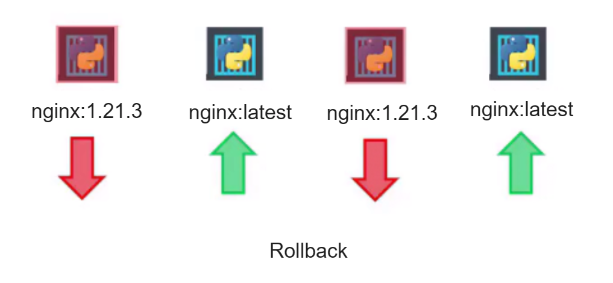
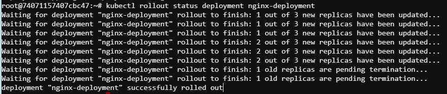
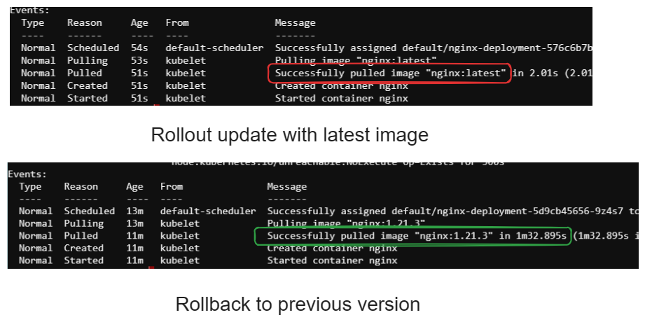

# Rollouts and Rollbacks in Kubernetes

In Kubernetes, rollouts and rollbacks are vital for managing application deployments. 

- **Rollout**: Gradually introducing updates or changes to an application to ensure a smooth transition and minimize disruptions.

- **Rollback**: Reverting changes made to an application back to a previous stable state to address issues or errors encountered after an update.

<!-- <div style="text-align:center"></div> -->

## Initialize Deployment with NGINX Image

To initialize a deployment with the  NGINX image (version 1.21.3), we can create a YAML file with the following contents

```
apiVersion: apps/v1
kind: Deployment
metadata:
  name: nginx-deployment
spec:
  replicas: 3
  selector:
    matchLabels:
      app: nginx
  template:
    metadata:
      labels:
        app: nginx
    spec:
      containers:
      - name: nginx
        image: nginx:1.21.3
        ports:
        - containerPort: 80
```

By using the kubectl command ``kubectl apply -f deployment.yaml` we can initialize the nginx deployments with 3 pods

## Rollout Update with New Image Version

To rollout an update with latest image version of nginx, we can edit the deployment's YAML configuration file to change the image version or we can use .After editing, apply the updated configuration using ``kubectl apply``.This will trigger a rollout, updating the NGINX deployment with the new image version.

**Update the image version from command line (optional)**

Without configuring the yaml file we can simply set the image version in command

```
kubectl set image deployment/myapp-deployment nginx=nginx:latest
```

To monitor the deployment's rollout progress 

```
kubectl rollout status deployment nginx-deployment
```

Expected output:

<div style="text-align:center"></div>


To monitor the rollout history (optional)

```
kubectl rollout history deployment/myapp-deployment
```
## Rollback the Update

If issues arise after the rollout and we need to rollback to the previous state, we can use the kubectl rollout undo command to go back to the previous version.

```
kubectl rollout undo deployment nginx-deployment
```

By executing this command, Kubernetes will automatically identify the previous revision of the deployment configuration and roll back to that state.

<div style="text-align:center"></div>