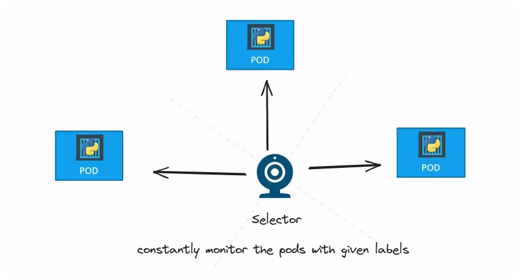
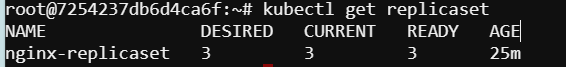
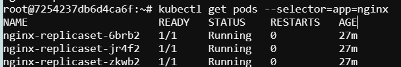
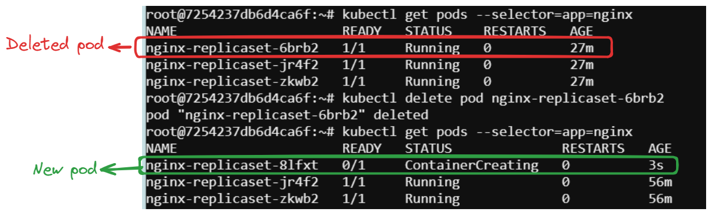

# ReplicaSet Deployment: Managing NGINX Pods in Kubernetes

We will demonastrate the ReplicaSet configuration by using nginx image,to ensure that a specified number of NGNIX pods are running at all times and the pods are always available in the kubernetes cluster.

### 1. Create a YAML Manifest for ReplicaSet configuration  using `vim` or `nano`

To install vim try this 
```
sudo apt update
sudo apt install vim
```

After successful installation of vim create the manifest file ``vim replicaset.yaml``

```
apiVersion: apps/v1
kind: ReplicaSet
metadata:
  name: nginx-replicaset
spec:
  replicas: 3
  selector:
    matchLabels:
      app: nginx
  template:
    metadata:
      labels:
        app: nginx
    spec:
      containers:
      - name: nginx
        image: nginx:latest
        ports:
        - containerPort: 80
```
Press ``ESC`` then type `:wq` then press `Enter` to save and exit from vim

#### 2. Creating Replicaset using kubectl command (OPTIONAL)

We can also generate the replicaset without using a YAML manifest file.To create the replicaset use the kubectl command with the appropriate flags and parameters.

```
kubectl create replicaset nginx-replicaset --image=nginx --replicas=3 --port=80
```

## 3. Apply the Manifest

Apply the YAML manifest using the ``kubectl apply`` command

```
kubectl apply -f replicaset.yaml
```
This will create the ReplicaSet and deploy 3 NGINX pods.

## 4. View Replicasets and Pods Managed by ReplicaSet

Once the ReplicaSet is deployed, we can manage it using kubectl commands.ReplicaSet ensures the the number of pods with labels `nginx` is always 3.If any of the pods were accidently destroyed or deleted,it will automatically generate the pod by using the template provided in definition file.

<div style="text-align:center"></div>

To view the replicasets and pods managed by replicset use this commands
```
kubectl get replicasets       #View ReplicaSets
kubectl get pods --selector=app=nginx    #View Pods Managed by ReplicaSet  
```
If the pods were successfully generated we will see something like this

<div style="text-align:center"></div>

<div style="text-align:center"></div>

## View the Availability of pods

Now if we delete any of the pods ,we will see within a second it will generate a new pod and the total number of pods will be remain same as 3.

<div style="text-align:center"></div>